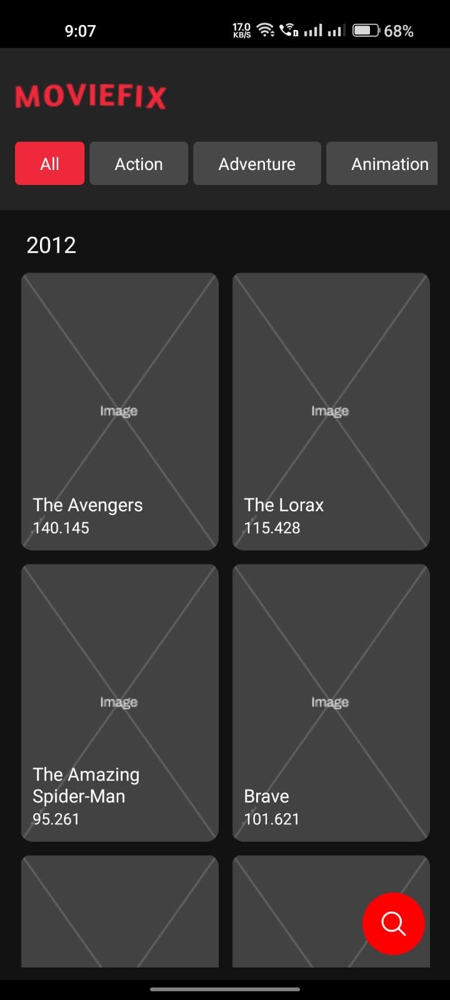
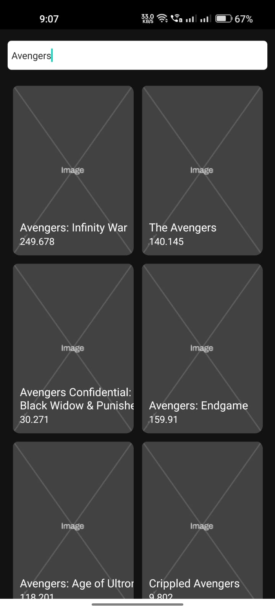

# MovieFix App

### About

Moviefix is a native app built in react-native, it shows list of movies from an api on the basis of different filters, like release year, popularity, etc.

### Features:

1. Built in react native.
2. Data grouped by year.
3. Supports infinite scroll in both direction i.e. scroll to top will fecth previuos year data and scrolling down will fetch the data of nect year if the data of current year ends.
4. Supports filter based on genres (supports AND and not OR), one can select multiple genres at a time.
5. Search a movie by typing movie name.

### How to Run in local ?

1. Install Node.js in your laptop/computer.
2. Download and install 'Expo' app from playstore.
3. Clone the repository.
4. Open the project in VS code or in any editor.
5. Open terminal, go to your project and run "npm install", to install all packages and dependencies.
6. Connect your android phone and laptop to same network i.e with same wifi.
7. Go to terminal and run "npm start", to run the project.
8. When it runs successfully, Open the "Expo" app in phone, and scan the QR code which is showing in the terminal.
9. Let the build complete, app will open automatically.
10. Try scrolling down and up, to get more data or try tapping on filters (genres).

#### Note 1

If not want to install "Expo" app, install any android emulator, in the laptop, start the emulator and when the server starts, press "a" to run the project in the emulator. (android studio may be needed.)

1. Start USB debugging in your android phone.
2. Once connected the device, run command , "adb devices" , to verify, if it is showing th device name then you are good to go.
3. Press "a" to run the project on your android device.

For any issue:
Follow this link to run on emulator or using usb debugging,
   [Connect android device using USB debugging or emulator ](https://reactnative.dev/docs/running-on-device)

### Note 2

Images not loading from the api, so used a static image for thumbnail.

## ScreenShots

